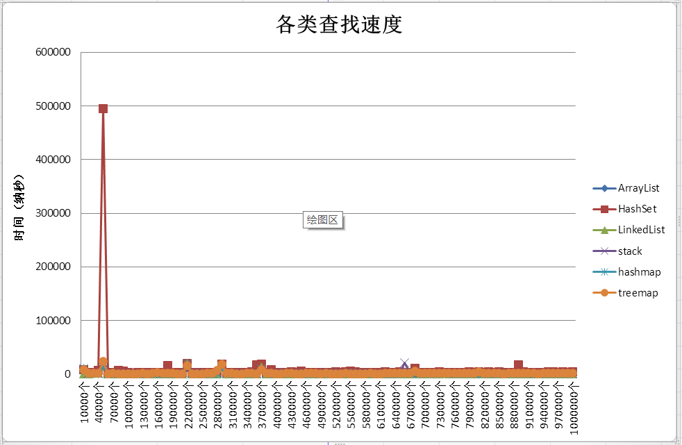
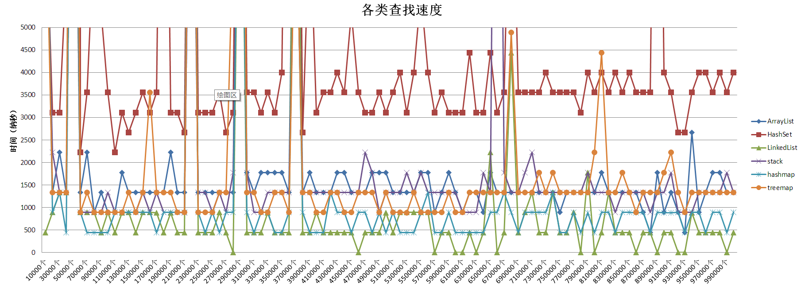
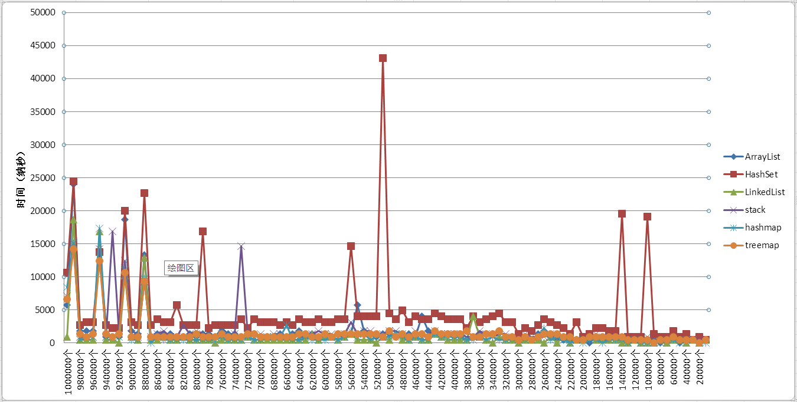
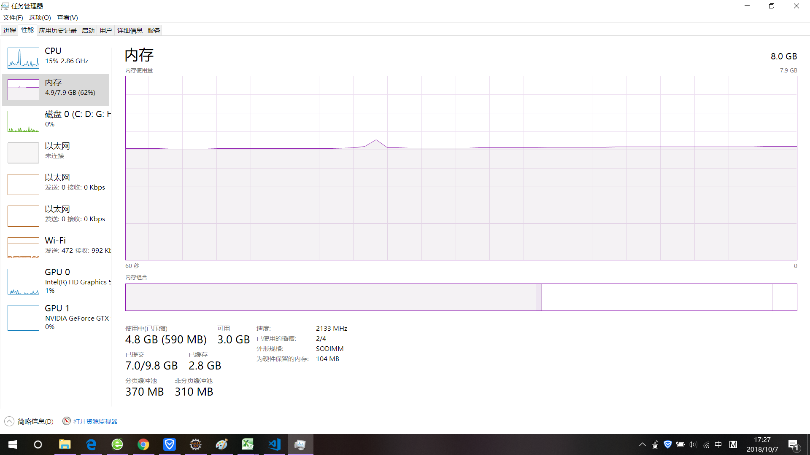

参与比较查找速度的6个类：ArrayList,LinkedList,HashSet,stack,HashMap,TreeMa

比较的方式：使用一个ArrayList来存放所有要查找数据(数据类型都是整形Integer)，数据不重复.
       
       数据不重复：从ArrayList中随机取数添加至的各个类实例容器中，然后将此数从ArrayList中删除，然后在继续随机取数防止各个容器中，以此保证放入各个类实例容器中的数据没有重复

问题：采用循环改变了不同容器的数据容量，但是不论数据总容量如何改变，最开始查找时，需要很多时间，后来无论改变数据总容量大小，查找速度都很快。
   
  猜想：忘了

[代码](CompareLocationSpeed/src/listLocation/listlocation.java)

