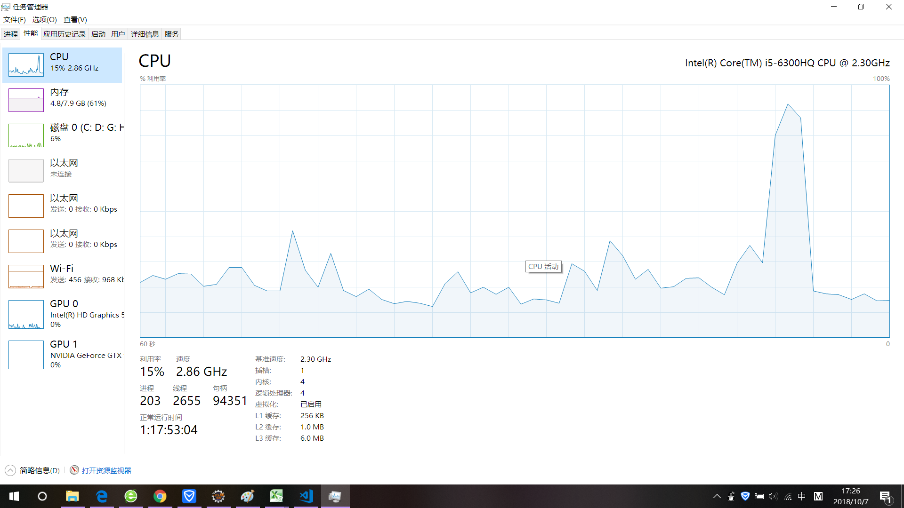

参与比较查找速度的6个类：ArrayList,LinkedList,HashSet,stack,HashMap,TreeMa

比较的方式：使用一个ArrayList作为所有数据(数据类型都是整形Integer)的容器，数据不重复,从ArrayList中随机取数添加的各个类实例容器中，然后将此数从ArrayList中删除，一次保证放入各个类实例容器中的数据没有重复

问题：采用循环改变了不同容器的数据容量，但是不论数据总容量如何改变，最开始查找费时，总比后来改变总容量大小后费时多

[代码](CompareLocationSpeed/src/listLocation/listlocation.java)

